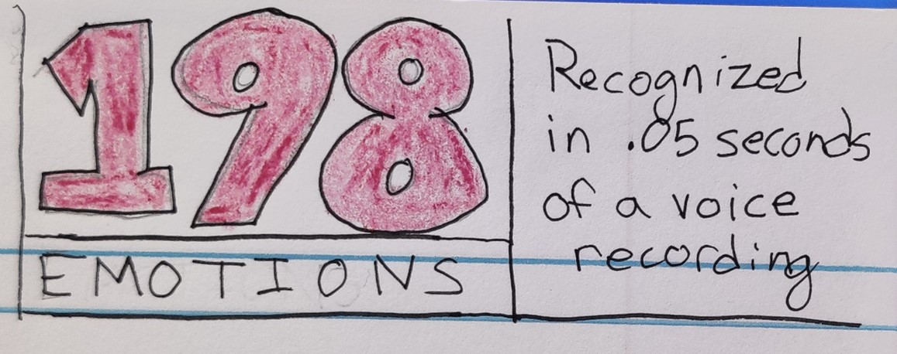
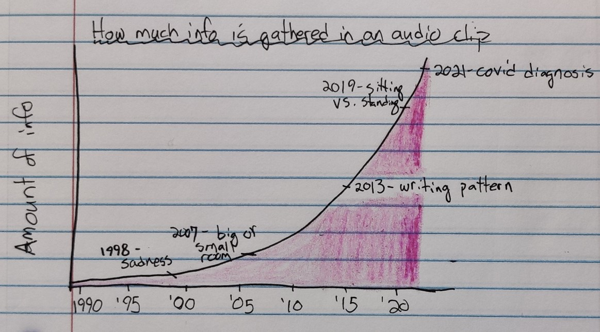
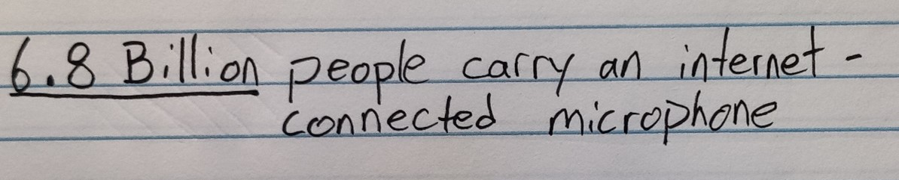
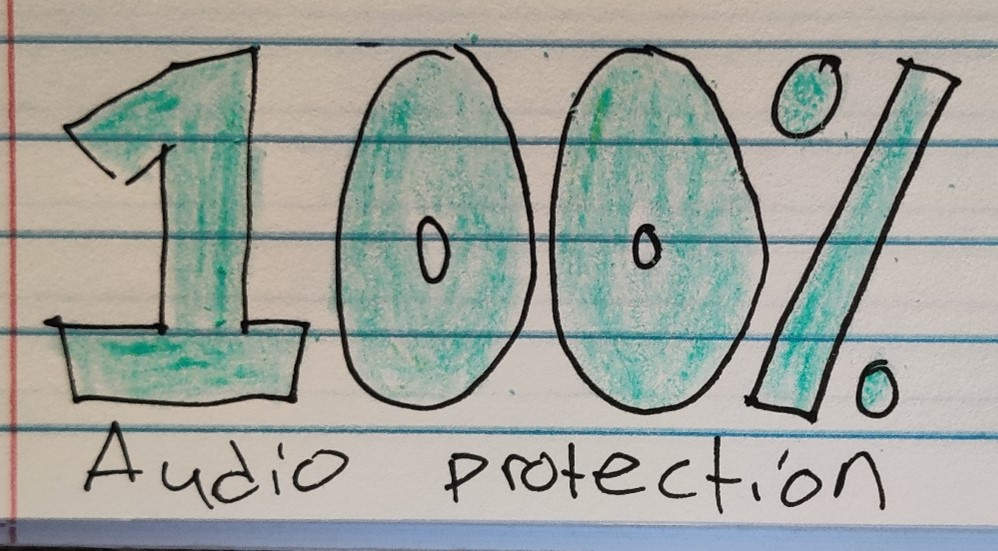

**Audio Privacy Risks**

Jessi Mazzoni

**Project Summary**
Malicious actors can use smart devices to listen to us without our consent, consequently collecting information about everything we discuss, our environment, and our wellbeing: can we do anything to stop this from happening?

**User Story**
As a reader, I want a solution to the problem of unwanted listening, so that I can take actions to protect my audio from malicious actors. 

**Call to Action** 
Buy my audio privacy product!!! Stay up to date with my product!!! Invest in my company!!

**Project Structure**
This presentation will illustrate the current landscape of risks related to audio privacy, then will provide the audience with a proposed solution to audio privacy risks. The format of the presentation may generally follow a tone of concern/worry about the situation before ending on a positive note by giving the audience some hope about protecting their audio privacy. The presentation will be broken down into three major themes/sections:

1.	The amount of information held in an audio clip. I want to illustrate how much information can be gathered about people talking in the clip and about the environment in which the clip was recorded. The purpose is to illustrate to the audience that our smart devices are not just recording the words that we speak; modern audio analyses allow a listener to know what our surroundings are when we record audio, as well as personal information like our emotions and health status. Sharing this information first will make the second section more impactful:

2.	How vulnerable our cellphones are to being accessed by malicious actors, whether hackers or apps including spyware. The audience should be made aware of the fact that their smartphones (which travel everywhere with them at all times) run a risk of having their microphones turned on without the user’s consent. Ideally, I will share data showing trends increasing in mobile breaches over time. This section should certainly have the audience feeling concerned.

3.	Finally, a solution for audio privacy will be presented, which is the product idea that I’m developing. I don’t exactly have data available for the product, but this should be the shortest of the three sections of my presentation. My call to action will likely be related to either investing in my company, joining my team, or staying up-to-date with the latest news about the product.

**Initial Sketches/Outline**
Opening with an attention-grabbing statistic about the power of audio analysis. Audience should be thinking “Wow! I can’t believe that my emotions might be analyzed just through short audio clips!”
 

Next, I would like to present a chart illustrating the advancements in audio analysis over time (I am really having a hard time finding this type of dataset, may need to adjust). This should give the audience a sense of how vast data collection from audio clips really is. Audience should be thinking “Oh man, Apple knows when I’m talking to Siri in the bathroom?”

Next, I want to tie the awareness of how much data is being gathered from audio to the fact that we all carry internet-connected microphones (our phones) with us everywhere we go. This should start to freak people out a little. The audience should be thinking, “Hmm someone could really learn a lot about me just by having access to my audio all day”
 

Next, we confirm the fear that I tried to create previously. I want to discuss how many malicious apps and malicious actors (hackers, malware) exist as threats to mobile devices. In addition to providing data, I would also like to use qualitative examples, such as the Pegasus hacking scandal in 2021, specifically highlighting the French President being hacked. Now the audience should be thinking, “Wow, audio security sounds like a big problem”. I need to track down better data in this section.
 

Finally, it’s time to make the audience feel better. I will tell them about my product, OffBox, which is guaranteed to provide 100% audio privacy protection by putting control into the user’s hands. I do not actually have any data to back up any of this though, it’s still just a theoretical idea, so I need to think about how detailed to be in this section.

**Data Sources**
Data about audio analysis: I am having a very hard time finding complete data regarding audio analysis. I may have to scrap this idea and instead focus on microphones if I can’t find data soon. 

I did find this chart from Statista, which seems helpful, but I have to pay $40 to access it, so I probably won’t use it: https://www.statista.com/statistics/1133833/speech-to-text-transcript-accuracy-rate-among-leading-companies/

**Data related to cellphone use (proliferation of internet-connected or cellular-network connected microphones):** I was able to find a great dataset from Our World in Data on the number of cellphones and smartphones used in the United States: https://ourworldindata.org/grapher/technology-adoption-by-households-in-the-united-states?country=Cellular+phone~Smartphone+usage

Not a dataset, but a helpful report illustrating that the number of overall app downloads is increasing annually: https://www.businessofapps.com/data/app-statistics/

**Data about mobile security:** A note, I am having trouble finding datasets as sources. I have found a good number of reports about mobile audio security that support my goal of illustrating an increasing risk, but the only complete dataset I could find related to mobile malware does not actually support my project (this was the Assignment 3/4 dataset).

Malicious code in smartphone applications found to exist in 10% of all apps: https://arxiv.org/pdf/1804.03603.pdf
Annual number of data breaches in the United States. While this does support my point, it relates to all types of data breaches, and is not mobile-focused: https://www.statista.com/statistics/273550/data-breaches-recorded-in-the-united-states-by-number-of-breaches-and-records-exposed/

Data about increased phishing attempts on mobile phones in Malaysia. This would be helpful data, but it is blocked by a paywall… https://www.statista.com/statistics/1043807/malaysia-detected-malicious-code-incidents-on-mobile-devices/

This dataset would be incredibly helpful, as it would provide me with the number of mobile malware incidents globally, but it is hidden behind a paywall: https://www.statista.com/statistics/325201/countries-share-of-malicious-attacks/

Potentially incredibly helpful report about mobile security threats in 2021, but it is not a dataset, just a report: https://securelist.com/it-threat-evolution-q2-2021-mobile-statistics/103636/

Verizon’s 2021 mobility security risk report, while this would be incredibly useful, it does not contain datasets to download: https://www.verizon.com/business/resources/reports/mobile-security-index/2021/mobile-threat-landscape/apps/

**Method and Medium**
Ideally, I would like to create this project within a website that I already own for my product/company idea. However, if that becomes too intensive in a short period of time, then I will probably use Shorthand. Ideally, I would like to use a mix of quantitative and qualitative data, simply because there is not enough strong quantitative data available for me to really tell the full story of audio privacy risks. For example, the Pegasus spyware incident of 2021 was a huge problem globally, but there is no definitive dataset on who was impacted by the spyware and how; there is only a guess of how many people were impacted and the type of threats they may have been exposed to through the software. For that reason, I will use anecdotal references through legitimate sources to represent qualitative information
