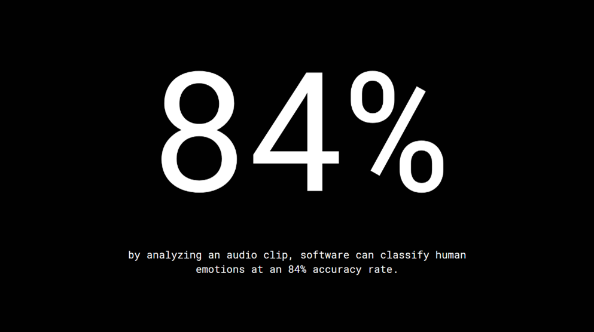
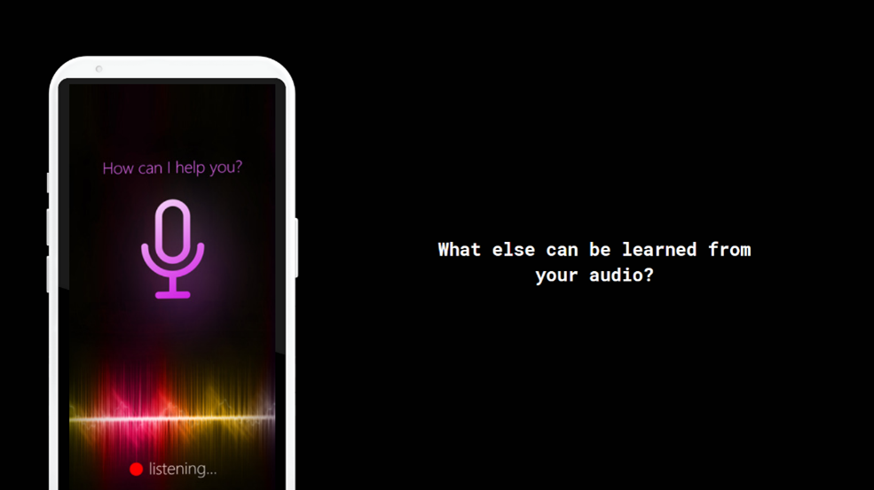
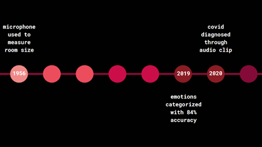
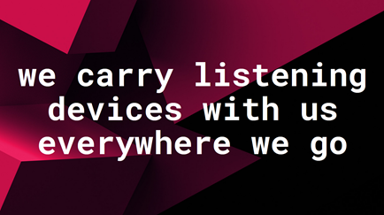
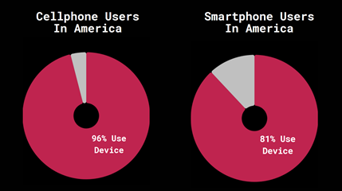
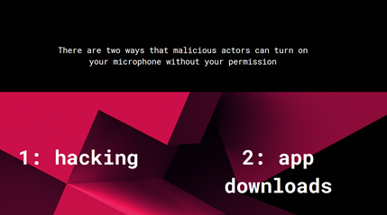
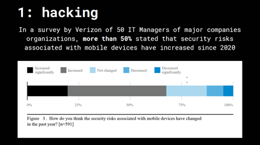
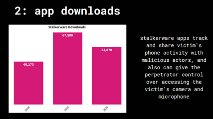
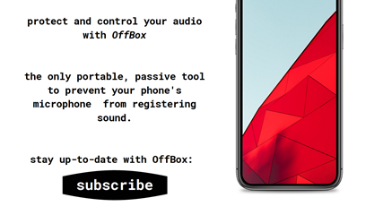

 
 
 
 
 
 
 
 
 
 

*User Research Protocol:*

•	Target Audience:

o	Seed fund investors, privacy experts, corporate and government IT managers and  risk managers

•	Approach to identifying representative individuals to interview:

o	Since my target audience lies outside my personal and professional network and will take time to develop connections with, the individuals I would like to interview for this stage of the project are those who understand IT and privacy and maybe individuals who work with electronics and telecommunications. I’m planning to reach out to my professional network, specifically a few individuals who work in electronics, as well as my personal network, including fellow students who are in the MISM track at Heinz. 

*•	Interview Script:*

o	“Hi, thank you for taking the time to meet with me. I am working on a project for one of my Heinz classes, and I would like to hear your thoughts on my project outline. Please stop me if you have any questions or suggestions.”

o	“Looking at the outline…”

	“What do you feel as you go through the different components?”

	“How easy or difficult is it to understand what is being shared in the outline?” 

•	“What would make it easier to understand?” 

	“What do you think you are supposed to learn from the outline?”

	“How likely would you be to tell someone about the information shared in the outline?”

	“How likely would you be to subscribe to learn more about the solution, OffBox?”

*•	Findings:*

o	“Looking at the outline…”

	“What do you feel as you go through the different components?”

•	1- I feel like you’re taking me through a story of smartphone privacy

•	2- I feel like I should be worried about microphones being everywhere

	“How easy or difficult is it to understand what is being shared in the outline?” 

•	1- Very easy

•	2- Kind of easy

•	“What would make it easier to understand?” 

o	1- The one graph that showed percentages of people saying security has increased over the past year.. it wasn’t immediately clear, it took me a minute to understand

o	2- You jump around from one topic to another, but there could be more to help transition between topics

“What do you think you are supposed to learn from the outline?”

•	1- Buy OffBox. There is no clear solution as of today for complete audio privacy.

•	2- Risks related to privacy, spying, and smartphones

“How likely would you be to tell someone about the information shared in the outline?”

•	1- 100% likely because I am personally passionate about privacy in general

•	2- Probably very likely because it’s something I don’t think people talk about, but it seems like a problem

“How likely would you be to subscribe to learn more about the solution, OffBox?”

•	1- 100% likely.

•	2- 75% likely

*	Changes based on feedback:*

o	Add transitions

o	Edit the Verizon graphic (I didn’t have time)

o	Re-work the cellphones/smartphones pie chart
