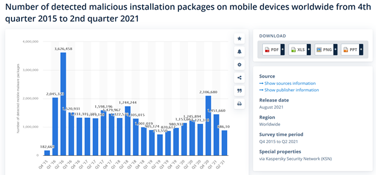
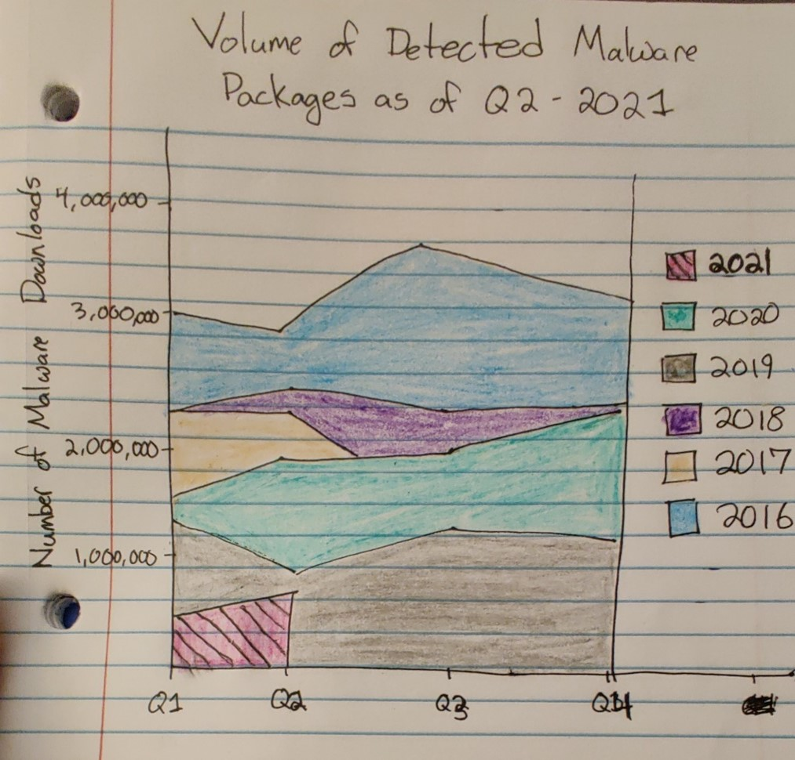
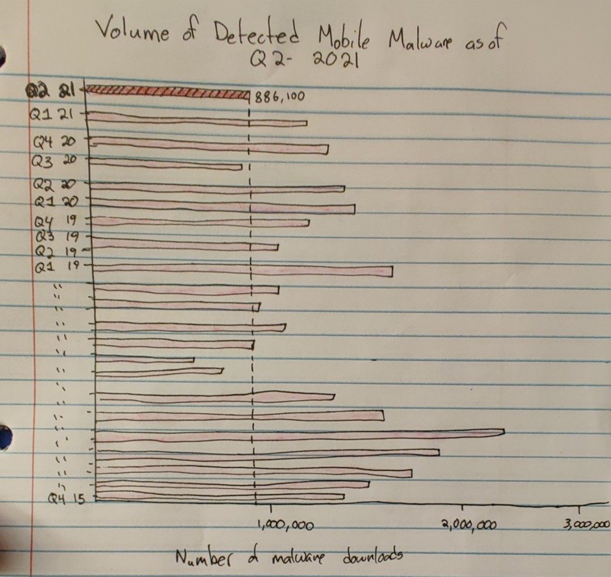
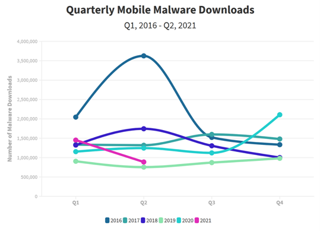

# fun-create-explore-box
https://github.com/jessicaemazzoni/fun-create-explore-box

About Me

My name is Jessi and I am originally from Pittsburgh! Home of the 3 rivers, gray skies, and friendly vibes. 

What I Hope to Learn

I hope to learn how to make websites much more beautiful than this one!

Portfolio

[Flourish Class Design](https://public.flourish.studio/resources/embed.js)

[Government Debt Bar Chart](https://data.oecd.org/chart/6vsI)

[Government Debt Grid Line Chart](https://public.flourish.studio/visualisation/7690473/)

[Jessi's Government Debt Chart](https://public.flourish.studio/visualisation/7690894/)

[Final Part 1](/FinalProjectPart1.md)

[Final Part 2](/FinalProjectPart2.md)

Assignment 3/4
Original Chart:

Describe your overall observations about the data visualization here. What stood out to you? What did you find worked really well? What didn't? What, if anything, would you do differently? *
While I believe this visualization contains truthful, complete data, it is not easy to look at because it is very monotonous, and I am left unsure if there is a specific message or understanding that the viewer is supposed to take away. 
My immediate thought looking at this chart is that it is very boring and not at all engaging, except viewing the large spike in Q2-2016, which made me wonder what happened at that point in time to cause more malware to be installed. The totals for each quarter that are all overlaid are difficult to read and make viewing the chart less enjoyable. Simply removing those numbers would improve the chart. The creator of this chart did a good job of scaling the chart on the y axis. The viewer is able to see a complete range of available data and easily view the changes in malware installations quarter to quarter. The x axis labels are also simple to read and understand, and the color of the bars (while monotonous) are at least not an overwhelming array of colors. 
I have a hard time with the title and intent of this chart, because the creator doesn’t seem to intend for the viewer to focus on any one thing in particular on the chart. Perhaps that is the intent, to display data without a specific motive (which makes sense coming from a website like Statistica). However, below the chart, there is additional supplemental information provided, which reads, “Volume of Detected Mobile Malware Packages as of Q2 2021”. Given that Q2 2021 is the most recent data available in the chart, and the fact that the creator included a note specifically mentioning Q2 2021, I would assume that the most recent data should be more prominently highlighted both in the chart and in the title. 
Given that information, the chart could be reconfigured to specifically call out the most recent data through different display methods like color callouts, line callouts, or an entirely new layout. I personally would try simply making the last bar a different color and adding a horizontal line from the top of the last bar across the x axis, so the viewer can easily see where the most recent data sits compared to other quarters. 

Who is the primary audience for this tool? Do you think this visualization is effective for reaching that audience? Why or why not? *
Given that this chart is posted on Statistica, I believe it’s target audience is anyone who is interested in the current landscape of mobile security threats, from both academic institutions and businesses. Since the chart is on Statistica, rather than a news website or blog, it isn’t meant to have a specific bias or support one narrative, I think that the visualization is effective because it is clearly just a display of raw data without any biases. Thus, I think it is helpful for the wide range of viewers who may seek out this information. However, I think it could be more effective and useful by calling out the most recent data, simply because mobile privacy is a quickly evolving field and data from even two years ago is often seen as outdated when it comes to tech. For these reasons, the most recent data is probably the most relevant for people like me who are studying mobile security

Redrawing the Chart, #1

 
Since it was so hard to tell if there was any trend among the data in the original chart, I thought it would be interesting to sketch a version of the chart in which data were displayed quarterly. If there were peaks around certain times of the year, it would be easier to see in this format (this drawing wasn’t done with the actual data, just wanted to represent the concept). I also wanted to include color and make the drawing more simple, which I felt like was accomplished with this drawing.
- Can you tell me what you think this is?
1.	It’s a graph about the number of malware downloads
2.	I think this is an illustration of malware downloads by year
- Can you describe to me what this is telling you?
1.	No 
2.	It looks like 2016 had the most downloads, and just some of 2021 had downloads. Everything else in between is hard to read.
- Is there anything you find surprising or confusing?
1.	In 2017it looks like the number of malware downloads went to zero or something cause it stopped after q2
2.	Yes, I’m getting confused looking at the colors (which I think are years) in the middle section of the graph, I can’t really figure out what is happening in the middle.
- Who do you think is the intended audience for this?
1.	Companies, executives, it people , cybersecurity decision makers
2.	Probably internet and phone providers
- Is there anything you would change or do differently?
1.	If this is intended to show malware downloads over the course of years compared to one another, I would not do the stacked graph
2.	I would not use this format, the colors stacked in this way don’t really let me feel like I have a full picture of the data. 

Redrawing the chart, #2

 
I felt that the original chart was very good in how complete and accurate it was. The display was a little cluttered though, and it wasn’t exactly easy to see how the most recent data compared to earlier data. By highlighting the most recent data and drawing a line across to display which quarters fell above and below the most recent, I thought this might be a simpler way to compare the data points. I also thought that flipping the x and y axis might make the viewing simpler. 
- Can you tell me what you think this is?
1.	Number of malware downloads
2.	Volume of malware in different quarters from 2021 to 2016
- Can you describe to me what this is telling you?
1.	Number of malware downloads over the course of a year compared from 2015-2021.
2.	I think it’s telling me that there’s a wide range of downloads.. no real pattern to follow
- Is there anything you find surprising or confusing?
1.	Not confusing but there’s no consistent trend in one direction or another
2.	The confusing part is just trying to look at all of the lines. I get the point of what this graph is showing a lot more than the other one, but it’s just hard to make out all of the lines.
- Who do you think is the intended audience for this?
1.	Cyber security or IT professionals
2.	Definitely some kind of security expert
- Is there anything you would change or do differently?
1.	I would put time on the x axis, it’s more intuitive
2.	I would get rid of all of the lines, but I know that’s hard because then you wouldn’t be displaying data

Redrawing the chart- Final version

 
I know that my final version is quite different from both of my sketches, but I actually think this chart is quite similar to Drawing #1. In both the original chart and Drawing #2 , it was very hard to discern any pattern in the data (if there were any pattern), since all of the data points were lined up all together. It was hard to even look at those charts because of all the monotonous lines. So, based on the feedback I received, I went ahead and kept the same general format as Drawing #1, by having quarters on the x axis, and number of downloads on the y axis, then representing each year as an individual data set. 
Since I heard that Drawing #1 was hard to discern given the huge color blocks, I thought it might be simpler to display the data per year as lines. I also colored 2016-2020 all in the same palate of light blue/greens and purple, then highlighted the most recent data from 2021 in a bold pink color. Since the audience is most likely people who are interested in, researching, or making money in the tech field, the most recent data should be the most prominent, given that technology changes so quickly (data from even 1-2 years ago could be obsolete). I also updated the title to be a simpler and tell the reader that they’d be viewing quarterly data, so that the reader knows how to view the chart.

Overall, I am happy with this final chart. Although there aren’t any major trends in the chart, it’s still easier for the reader to see any potential patterns, compared to the original Statistica chart. I think this chart is easier to read and view, but still remains complete. 
